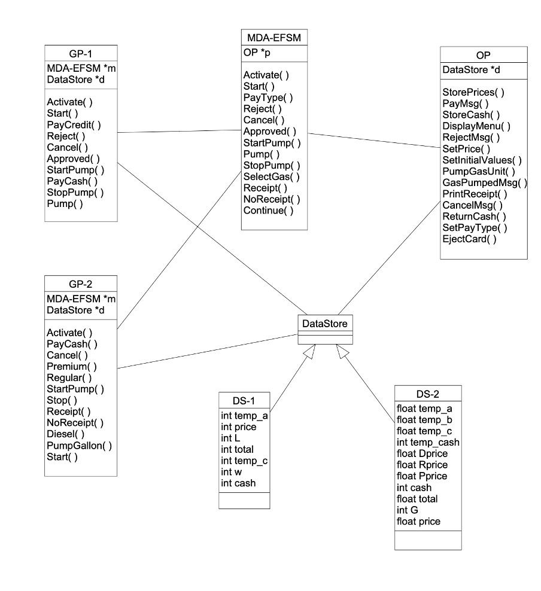
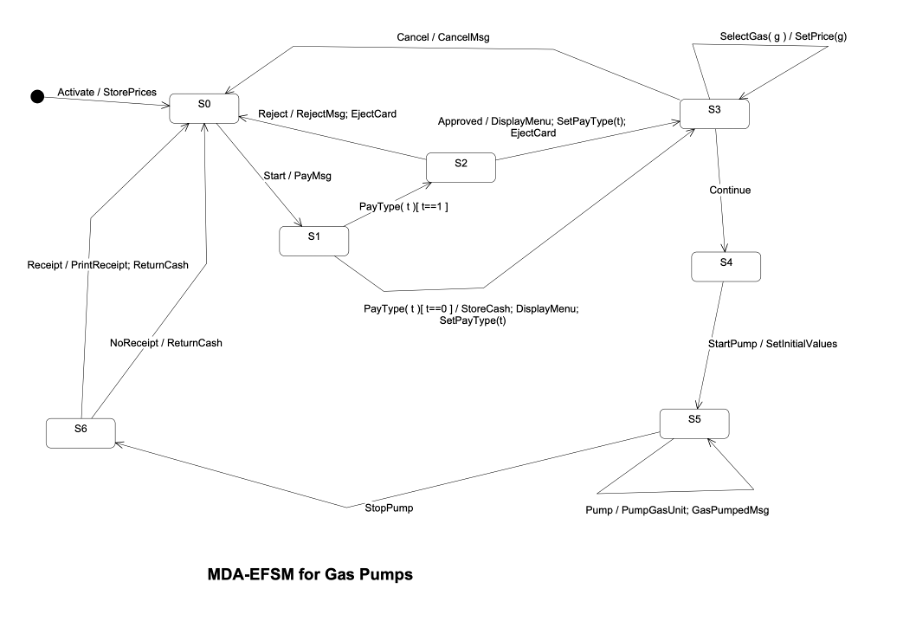
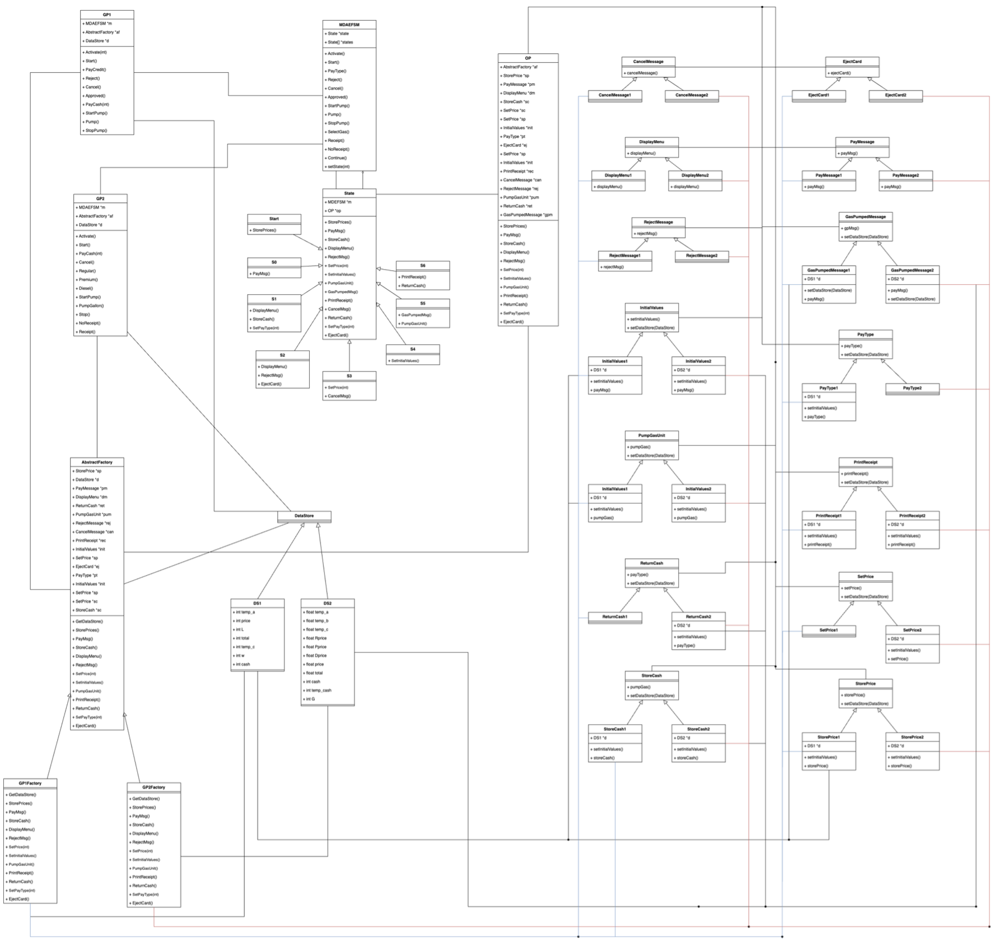
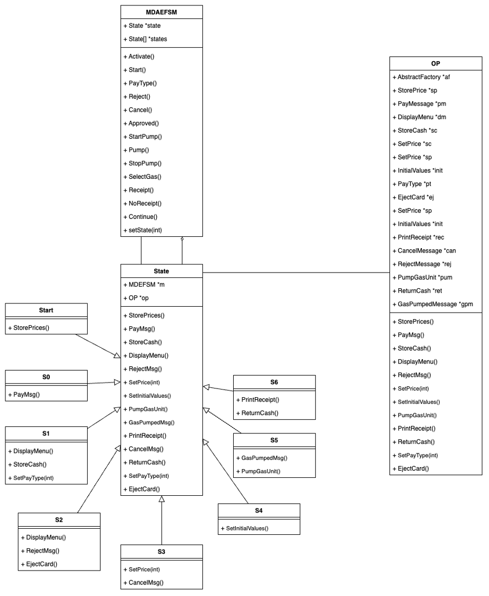
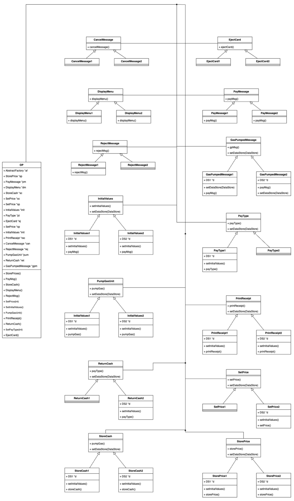
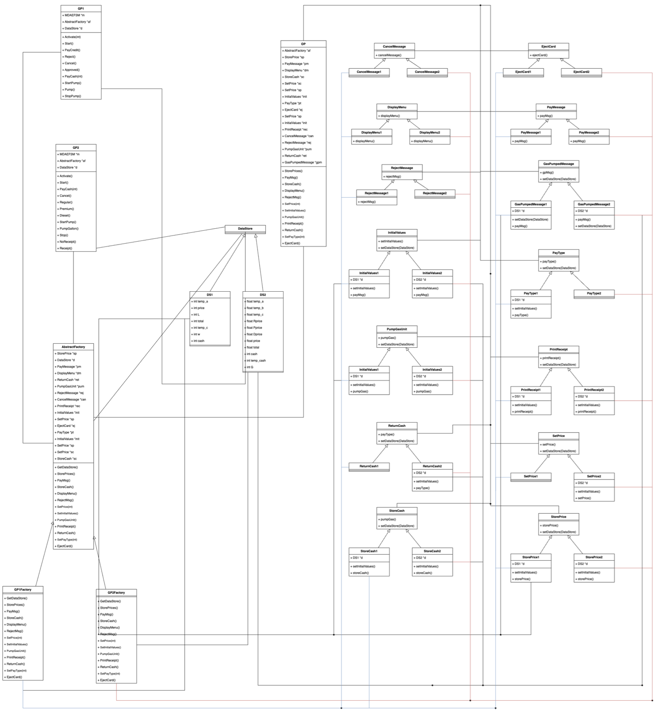

# CS 586 - Software Systems Architecture - Project Documentation
This project was built as part of CS-586 Software Systems Architecture demonstrating ability to understand and implement various design patterns to such as Abstract Factory, Strategy, and State Pattern in an Object Oriented Language.
This project was implemented in Java. The problem statement is to implement 2 gas pumps with two different State diagrams and build it using the model driven architecture (MDA).
## Contents

1. [MDAEFSM Model](#mdaefsm-model)
    2. [List of Meta Events for MDA-EFSM](#list-of-meta-events-for-mda-efsm)
    3. [List of Meta Action for MDA-EFSM](#list-of-meta-action-for-mda-efsm)
2. [Class Diagrams](#class-diagrams)
4. [Class Responsibilities](#class-responsibilities)
## Project Gas Pump MDA-EFSM

### 1.  MDAEFSM Model

Figure 1: MDA-EFSM Class Diagram

### 1.1.  List of Meta Events for MDA-EFSM

1.  Activate() //Initializing

2.  Start() //Show the PayMessage and Change State

3.  PayType(int t) //credit: t=1; cash: t=0;

4.  Reject() // Credit card failed

5.  Cancel() //Cancel current transaction and show cancel message

6.  Approved() // Event that the credit card is approved

7.  StartPump() // Start the pumping procedure

8.  Pump() // Pump the gas per unit

9.  StopPump() // Stop Pumping the gas

10.  SelectGas(int g) // Regular: g=1; Diesel: g=2; Premium: g=3

11.  Receipt() // Handle Generation of Receipt

12.  NoReceipt() // Handle No Receipt Scenario

13.  Continue() // Go to next state

### 1.2.  List of Meta Action for MDA-EFSM

1.  StorePrices() // stores price(s) for the gas from the temporary data store

2.  PayMsg() // displays a type of payment method

3.  StoreCash() // stores cash from the temporary data store

4.  DisplayMenu() // display a menu with a list of selections

5.  RejectMsg() // displays credit card not approved message

6.  SetPrice(int g) // set the price for the gas identified by g identifier as in

7.  SelectGas(int g); SetInitialValues() // set G (or L) and total to 0;

8.  PumpGasUnit() // disposes unit of gas and counts # of units disposed and computes Total

9.  GasPumpedMsg() // displays the amount of disposed gas

10.  PrintReceipt() // print a receipt

11.  CancelMsg() // displays a cancellation message

12.  ReturnCash() // returns the remaining cash

13.  SetPayType(t) // Stores pay type t to variable w in the data store

14.  EjectCard() // Card is ejected

15.  PayMessage() // Show the Pay Message

### 1.3.  State Diagram/Model of the MDA-EFSM

Figure 2: MDA-EFSM State Diagram

## 2.  Class Diagrams

### 2.1.  Full Class Diagram (Complete)

Figure 3: Full Class Diagram

#### 2.2.  MDAEFSM Class Diagram (State Pattern)  (Components Isolated)

Figure 4: MDEFSM Implementing the State Pattern, (Isolated Class Diagram)

#### 2.3.  Strategy Pattern Class Diagram (Components Isolated)

Figure 5: Output Processor Implementing Strategy pattern.

#### 2.4.  Abstract Factory Pattern Class Diagram (Components Isolated)

Figure 6: Abstract Factory Pattern to create new objects

## 3.  Class Responsibilities

<table><tbody><tr><th colspan="2"><h4><strong>Class Main</strong></h4></th></tr><tr><td>
<strong>Purpose</strong>
</td><td>
Driver for the application, responsible for displaying the menu and Initiating the classes.
</td></tr><tr><td colspan="2">
<strong>Operations</strong>
</td></tr><tr><td>
main()
</td><td>
Starts the program
</td></tr><tr><td>
displayMenu()
</td><td>
Displays menu to choose gp1 or gp2
</td></tr><tr><td>
startGasPump1(scanner)
</td><td>
Display menu for gp1 operations
</td></tr><tr><td>
startGasPump2(scanner)
</td><td>
Display menu for gp2 operations
</td></tr></tbody></table>

<table><tbody><tr><th colspan="2"><h4><strong>Class GP1</strong></h4></th></tr><tr><td>
<strong>Purpose</strong>
</td><td>
Class represents GasPump 1 and its operations
</td></tr><tr><td colspan="2">
<strong>Attributes</strong>
</td></tr><tr><td>
MDAEFSM m
</td><td>
Pointer to the MDAEFSM class
</td></tr><tr><td>
DataStore d
</td><td>
Pointer to the DataStore (DS1)
</td></tr><tr><td>
AbstractFactory af
</td><td>
Pointer to the AbstractFactory GP1Factory
</td></tr><tr><td colspan="2">
<strong>Operations</strong>
</td></tr><tr><td>
Activate(int)
</td><td>
Starts the GP setting initial values
</td></tr><tr><td>
Start()
</td><td>
Starts the GasPump procedure
</td></tr><tr><td>
PayCredit()
</td><td>
Pay by credit
</td></tr><tr><td>
Reject()
</td><td>
Reject message for credit payment
</td></tr><tr><td>
cancel()
</td><td>
Cancel Transaction
</td></tr><tr><td>
Approved()
</td><td>
Credit Transaction Approved
</td></tr><tr><td>
PayCash(int)
</td><td>
Pay by Cash
</td></tr><tr><td>
StartPump()
</td><td>
Start Pumping
</td></tr><tr><td>
Pump()
</td><td>
Pump 1 L of gas
</td></tr><tr><td>
StopPump()
</td><td>
Stop Pumping and show receipt
</td></tr></tbody></table>

<table><tbody><tr><th colspan="2"><h4><strong>Class GP2</strong></h4></th></tr><tr><td>
<strong>Purpose</strong>
</td><td>
Class represents GasPump 2 and its operations
</td></tr><tr><td colspan="2">
<strong>Attributes</strong>
</td></tr><tr><td>
MDAEFSM m
</td><td>
Pointer to the MDAEFSM class
</td></tr><tr><td>
DataStore d
</td><td>
Pointer to the DataStore (DS2)
</td></tr><tr><td>
AbstractFactory af
</td><td>
Pointer to the AbstractFactory GP1Factory
</td></tr><tr><td colspan="2">
<strong>Operations</strong>
</td></tr><tr><td>
Activate(float,float,float)
</td><td>
Starts the GP setting initial fuel values
</td></tr><tr><td>
Start()
</td><td>
Starts the GasPump procedure
</td></tr><tr><td>
Cancel()
</td><td>
Cancel Transaction
</td></tr><tr><td>
PayCash(int)
</td><td>
Pay amount by Cash
</td></tr><tr><td>
StartPump()
</td><td>
Start Pumping
</td></tr><tr><td>
Pump()
</td><td>
Pump 1 Gallon of gas
</td></tr><tr><td>
StopPump()
</td><td>
Stop Pumping and show receipt
</td></tr><tr><td>
Regular()
</td><td>
Select Regular gas
</td></tr><tr><td>
Premium()
</td><td>
Select premium gas
</td></tr><tr><td>
Diesel()
</td><td>
Select diesel
</td></tr><tr><td>
Receipt()
</td><td>
Generate Receipt and return change
</td></tr><tr><td>
NoReceipt()
</td><td>
Return change without generating a receipt
</td></tr></tbody></table>

<table><tbody><tr><th colspan="2"><h4><strong>Class MDAEFSM</strong></h4></th></tr><tr><td>
<strong>Purpose</strong>
</td><td>
MDEFSM modelling of the GasPumps, context class of the State Pattern
</td></tr><tr><td colspan="2">
<strong>Attributes</strong>
</td></tr><tr><td>
ArrayList&lt;State&gt; states
</td><td>
List of States
</td></tr><tr><td>
State state
</td><td>
Current State
</td></tr><tr><td colspan="2">
<strong>Operations</strong>
</td></tr><tr><td>
MDAEFSM(OP)
</td><td>
Constructor with the op reference in the parameter to initialize the states with the pointer to the current output processor object.
</td></tr><tr><td>
setState(int)
</td><td>
Set the current state by Index
</td></tr><tr><td>
Activate()
</td><td>
Activate the GasPump
</td></tr><tr><td>
Start()
</td><td>
Start the Gas Pump Activity, with the initial state
</td></tr><tr><td>
PayType(int)
</td><td>
Sets the pay type, 0 for cash, 1 for card
</td></tr><tr><td>
Reject()
</td><td>
Rejection behaviour for Rejected credit cards
</td></tr><tr><td>
Cancel()
</td><td>
Method to handle cancellation of current transaction
</td></tr><tr><td>
Approved()
</td><td>
Handle Approved credit card.
</td></tr><tr><td>
StartPump()
</td><td>
Start the gas pumping procedure
</td></tr><tr><td>
Pump()
</td><td>
Pump one unit of gas
</td></tr><tr><td>
StopPump()
</td><td>
Stop the pumping procedure
</td></tr><tr><td>
SelectGas()
</td><td>
Choose the gas type to pump
</td></tr><tr><td>
Receipt()
</td><td>
Generate Receipt for the pumping procedure and return change
</td></tr><tr><td>
NoReceipt()
</td><td>
Return Change without Generating Receipt
</td></tr><tr><td>
Continue()
</td><td>
Proceed to the next state from S3 to S4, used for modelling GP1’s behavior to our EFSM
</td></tr></tbody></table>

<table><tbody><tr><th colspan="2"><h4><strong>Class OP</strong></h4></th></tr><tr><td>
<strong>Purpose</strong>
</td><td>
MDEFSM modelling of the GasPumps, Output Processor OP, Implements
</td></tr><tr><td colspan="2">
<strong>Attributes</strong>
</td></tr><tr><td>
AbstractFactory af;
</td><td>
Pointer to the Abstract Factory of the GP
</td></tr><tr><td>
StorePrice sp;
</td><td>
Pointer to the StorePrice object (implementing strategy pattern)
</td></tr><tr><td>
PayMessage pm;
</td><td>
Pointer to the PayMsg object (implementing strategy pattern)
</td></tr><tr><td>
DisplayMenu dm;
</td><td>
Pointer to the DisplayMenu object (implementing strategy pattern)
</td></tr><tr><td>
StoreCash sc;
</td><td>
Pointer to the StoreCash

(implementing strategy pattern)
</td></tr><tr><td>
SetPrice setP;
</td><td>
Pointer to the SetPrice

(implementing strategy pattern)
</td></tr><tr><td>
InitialValues init;
</td><td>
Pointer to the InitialValues (implementing strategy pattern)
</td></tr><tr><td>
PayType pt;
</td><td>
Pointer to the PayType

(implementing strategy pattern)
</td></tr><tr><td>
EjectCard ej;
</td><td>
Pointer to the EjectCard (implementing strategy pattern)
</td></tr><tr><td>
PrintReceipt rec;
</td><td>
Pointer to the PrintReceipt (implementing strategy pattern)
</td></tr><tr><td>
CancelMessage can;
</td><td>
Pointer to the CancelMsg (implementing strategy pattern)
</td></tr><tr><td>
RejectMessage rej;
</td><td>
Pointer to the RejectMsg (implementing strategy pattern)
</td></tr><tr><td>
PumpGasUnit pum;
</td><td>
Pointer to PumpGasUnit (implementing strategy pattern)
</td></tr><tr><td>
ReturnCash ret;
</td><td>
Pointer to the ReturnCash (implementing strategy pattern)
</td></tr><tr><td>
GasPumpedMessage gpm;
</td><td>
Pointer to the GasPumpedMsg (implementing strategy pattern)
</td></tr><tr><td colspan="2">
<strong>Operations</strong>
</td></tr><tr><td>
StorePrices()
</td><td>
Sets the available gas prices in the DS
</td></tr><tr><td>
PayMsg()
</td><td>
Requests the user for payment method
</td></tr><tr><td>
StoreCash()
</td><td>
Store the inserted cash in the DS
</td></tr><tr><td>
DisplayMenu()
</td><td>
Display the user Menu for Gas Pumping
</td></tr><tr><td>
RejectMsg()
</td><td>
Display the Message if card is rejected
</td></tr><tr><td>
SetPrice(int)
</td><td>
Set the price to be the price of the currently selected gas in the DS
</td></tr><tr><td>
SetInitialValues()
</td><td>
Set the initial values before pumping to 0
</td></tr><tr><td>
PumpGasUnit()
</td><td>
Pump one unit of gas, and perform the required calculations
</td></tr><tr><td>
GasPumpedMsg()
</td><td>
Display the message for successful gas pumped
</td></tr><tr><td>
PrintReceipt()
</td><td>
Print the Receipt
</td></tr><tr><td>
CancelMsg()
</td><td>
Cancel message for Transaction Cancellation
</td></tr><tr><td>
ReturnCash()
</td><td>
Calculate the change and return the cash
</td></tr><tr><td>
SetPayType(int)
</td><td>
Set payment to cash at int = 0 and card at int = 1
</td></tr><tr><td>
EjectCard()
</td><td>
Eject the users inserted card
</td></tr></tbody></table>

<table><tbody><tr><th colspan="2"><h4><strong>Class State</strong></h4></th></tr><tr><td>
<strong>Purpose</strong>
</td><td>
State abstract class, all other state classes inherit this class and are used in State Pattern in conjunction with the MDEFSM class.
</td></tr><tr><td colspan="2">
<strong>Attributes</strong>
</td></tr><tr><td>
OP op
</td><td>
Pointer to the Output processor OP
</td></tr><tr><td colspan="2">
<strong>Operations</strong>
</td></tr><tr><td>
State()
</td><td>
Initialize the state with pointers to the MDEFSM and the OP classes
</td></tr><tr><td>
StorePrices()
</td><td>
Store the initial fuel prices in the datastore
</td></tr><tr><td>
PayMsg()
</td><td>
Requests the user for payment method
</td></tr><tr><td>
StoreCash()
</td><td>
Store the inserted cash in the DS
</td></tr><tr><td>
DisplayMenu()
</td><td>
Display the user Menu for Gas Pumping
</td></tr><tr><td>
RejectMsg()
</td><td>
Display the Message if card is rejected
</td></tr><tr><td>
SetPrice(int)
</td><td>
Set the price to be the price of the currently selected gas in the DS
</td></tr><tr><td>
SetInitialValues()
</td><td>
Set the initial values before pumping to 0
</td></tr><tr><td>
PumpGasUnit()
</td><td>
Pump one unit of gas, and perform the required calculations
</td></tr><tr><td>
GasPumpedMsg()
</td><td>
Display the message for successful gas pumped
</td></tr><tr><td>
PrintReceipt()
</td><td>
Print the Receipt
</td></tr><tr><td>
CancelMsg()
</td><td>
Cancel message for Transaction Cancellation
</td></tr><tr><td>
ReturnCash()
</td><td>
Calculate the change and return the cash
</td></tr><tr><td>
SetPayType(int)
</td><td>
Set payment to cash at int = 0 and card at int = 1
</td></tr><tr><td>
EjectCard()
</td><td>
Eject the users inserted card
</td></tr></tbody></table>

<table><tbody><tr><th colspan="2"><h4><strong>Class Start</strong></h4></th></tr><tr><td>
<strong>Purpose</strong>
</td><td>
State abstract class, all other state classes inherit this class and are used in State Pattern in conjunction with the MDEFSM class.
</td></tr><tr><td colspan="2">
<strong>Operations</strong>
</td></tr><tr><td>
Start()
</td><td>
Initialize the state with pointer to OP class
</td></tr><tr><td>
StorePrices()
</td><td>
Store the initial fuel prices in the datastore, call the method from the output procesor
</td></tr></tbody></table>

<table><tbody><tr><th colspan="2"><h4><strong>Class S0</strong></h4></th></tr><tr><td>
<strong>Purpose</strong>
</td><td>
Class Representing the state S0 extends the base State class.
</td></tr><tr><td colspan="2">
<strong>Operations</strong>
</td></tr><tr><td>
S0()
</td><td>
Initialize the state with pointer to OP class
</td></tr><tr><td>
PayMsg()
</td><td>
Requests the user for payment method
</td></tr></tbody></table>

<table><tbody><tr><th colspan="2"><h4><strong>Class S1</strong></h4></th></tr><tr><td>
<strong>Purpose</strong>
</td><td>
Class Representing the state S1 extends the base State class.
</td></tr><tr><td colspan="2">
<strong>Operations</strong>
</td></tr><tr><td>
S1()
</td><td>
Initialize the state with pointer to OP class
</td></tr><tr><td>
SetPayType(int)
</td><td>
Set payment to cash at int = 0 and card at int = 1
</td></tr><tr><td>
StoreCash()
</td><td>
Store the inserted cash in the DS
</td></tr><tr><td>
DisplayMenu()
</td><td>
Display the user Menu for Gas Pumping
</td></tr></tbody></table>

<table><tbody><tr><th colspan="2"><h4><strong>Class S2</strong></h4></th></tr><tr><td>
<strong>Purpose</strong>
</td><td>
Class Representing the state S2 extends the base State class.
</td></tr><tr><td colspan="2">
<strong>Operations</strong>
</td></tr><tr><td>
S2()
</td><td>
Initialize the state with pointer to OP class
</td></tr><tr><td>
DisplayMenu()
</td><td>
Display the user Menu for Gas Pumping
</td></tr><tr><td>
RejectMsg()
</td><td>
Display the Message if card is rejected
</td></tr><tr><td>
EjectCard()
</td><td>
Eject the users inserted card
</td></tr><tr><td>
SetPayType(int)
</td><td>
Set payment to cash at int = 0 and card at int = 1
</td></tr></tbody></table>

<table><tbody><tr><th colspan="2"><h4><strong>Class S3</strong></h4></th></tr><tr><td>
<strong>Purpose</strong>
</td><td>
Class Representing the state S3 extends the base State class.
</td></tr><tr><td colspan="2">
<strong>Operations</strong>
</td></tr><tr><td>
S3()
</td><td>
Initialize the state with pointer to OP class
</td></tr><tr><td>
CancelMsg()
</td><td>
Cancel message for Transaction Cancellation
</td></tr><tr><td>
SetPrice(int)
</td><td>
Set the price to be the price of the currently selected gas in the DS
</td></tr></tbody></table>

<table><tbody><tr><th colspan="2"><h4><strong>Class S4</strong></h4></th></tr><tr><td>
<strong>Purpose</strong>
</td><td>
Class Representing the state S4 extends the base State class.
</td></tr><tr><td colspan="2">
<strong>Operations</strong>
</td></tr><tr><td>
S4()
</td><td>
Initialize the state with pointer to OP class
</td></tr><tr><td>
SetInitialValues()
</td><td>
Set the initial values before pumping to 0
</td></tr></tbody></table>

<table><tbody><tr><th colspan="2"><h4><strong>Class S5</strong></h4></th></tr><tr><td>
<strong>Purpose</strong>
</td><td>
Class Representing the state S5 extends the base State class.
</td></tr><tr><td colspan="2">
<strong>Operations</strong>
</td></tr><tr><td>
S5()
</td><td>
Initialize the state with pointer to OP class
</td></tr><tr><td>
PumpGasUnit()
</td><td>
Pump one unit of gas, and perform the required calculations
</td></tr><tr><td>
GasPumpedMsg()
</td><td>
Display the message for successful gas pumped
</td></tr></tbody></table>

<table><tbody><tr><th colspan="2"><h4><strong>Class S6</strong></h4></th></tr><tr><td>
<strong>Purpose</strong>
</td><td>
Class Representing the state S6 extends the base State class.
</td></tr><tr><td colspan="2">
<strong>Operations</strong>
</td></tr><tr><td>
S6()
</td><td>
Initialize the state with pointer to OP class
</td></tr><tr><td>
PrintReceipt()
</td><td>
Print the Receipt
</td></tr><tr><td>
ReturnCash()
</td><td>
Calculate the change and return the cash
</td></tr></tbody></table>

<table><tbody><tr><th colspan="2"><h4><strong>Class DataStore</strong></h4></th></tr><tr><td>
<strong>Purpose</strong>
</td><td>
Parent class Representing the datastore
</td></tr></tbody></table>

<table><tbody><tr><th colspan="2"><h4><strong>Class DS1</strong></h4></th></tr><tr><td>
<strong>Purpose</strong>
</td><td>
Class Representing the DataStore of GP1, extends DataStore class
</td></tr><tr><td colspan="2">
<strong>Attributes</strong>
</td></tr><tr><td>
int temp_a
</td><td>
Temp store for initialization parameter ‘a’ to fit MDAEFSM compliance.
</td></tr><tr><td>
Int price
</td><td>
Stores price of the gas
</td></tr><tr><td>
Int L
</td><td>
Amount of liters pumped
</td></tr><tr><td>
Int total
</td><td>
Total cost
</td></tr><tr><td>
Int w
</td><td>
Payment type , 0 = cash, 1 = card
</td></tr><tr><td>
Int cash
</td><td>
Total cash input in the GasPump
</td></tr></tbody></table>

<table><tbody><tr><th colspan="2"><h4><strong>Class DS2</strong></h4></th></tr><tr><td>
<strong>Purpose</strong>
</td><td>
Class Representing the DataStore of GP2, extends DataStore class
</td></tr><tr><td colspan="2">
<strong>Attributes</strong>
</td></tr><tr><td>
float temp_a
</td><td>
Temp store for initialization parameter ‘a’ to fit MDAEFSM compliance.
</td></tr><tr><td>
float temp_b
</td><td>
Temp store for initialization parameter ‘b’ to fit MDAEFSM compliance.
</td></tr><tr><td>
float temp_c
</td><td>
Temp store for initialization parameter ‘c’ to fit MDAEFSM compliance.
</td></tr><tr><td>
Int price
</td><td>
Stores price of the gas
</td></tr><tr><td>
Int G
</td><td>
Amount of Gallons pumped
</td></tr><tr><td>
float total
</td><td>
Total cost
</td></tr><tr><td>
Int Dprice
</td><td>
Price of Diesel
</td></tr><tr><td>
Int Pprice
</td><td>
Price of Premium Gas
</td></tr><tr><td>
Int Rprice
</td><td>
Price of Regular Gas
</td></tr><tr><td>
Int cash
</td><td>
Total cash input in the GasPump
</td></tr></tbody></table>

<table><tbody><tr><th colspan="2"><h4><strong>Class CancelMessage</strong></h4></th></tr><tr><td>
<strong>Purpose</strong>
</td><td>
Base class for Cancel Message Strategy
</td></tr><tr><td colspan="2">
<strong>Operations</strong>
</td></tr><tr><td>
cancelMessage()
</td><td>
Print the Cancellation message
</td></tr></tbody></table>

<table><tbody><tr><th colspan="2"><h4><strong>Class CancelMessage1</strong></h4></th></tr><tr><td>
<strong>Purpose</strong>
</td><td>
Implementation of the Cancel Message Strategy for GP1 extends CancelMessage
</td></tr><tr><td colspan="2">
<strong>Operations</strong>
</td></tr><tr><td colspan="2">
Currently uses parent class’s method, open for future customization/changes.
</td></tr></tbody></table>

<table><tbody><tr><th colspan="2"><h4><strong>Class CancelMessage2</strong></h4></th></tr><tr><td>
<strong>Purpose</strong>
</td><td>
Implementation of the Cancel Message Strategy for GP2 extends CancelMessage
</td></tr><tr><td colspan="2">
<strong>Operations</strong>
</td></tr><tr><td colspan="2">
Currently uses parent class’s method, open for future customization/changes.
</td></tr></tbody></table>

<table><tbody><tr><th colspan="2"><h4><strong>Class DisplayMenu</strong></h4></th></tr><tr><td>
<strong>Purpose</strong>
</td><td>
Base class for Display Menu Strategy
</td></tr><tr><td colspan="2">
<strong>Operations</strong>
</td></tr><tr><td>
displayMenu()
</td><td>
Abstract method for displayMenu()
</td></tr></tbody></table>

<table><tbody><tr><th colspan="2"><h4><strong>Class DisplayMenu1</strong></h4></th></tr><tr><td>
<strong>Purpose</strong>
</td><td>
Implementation of the Display Message Strategy for GP1 extends DisplayMenu
</td></tr><tr><td colspan="2">
<strong>Operations</strong>
</td></tr><tr><td>
displayMenu()
</td><td>
Display menu prompting to start pumping gas.
</td></tr></tbody></table>

<table><tbody><tr><th colspan="2"><h4><strong>Class DisplayMenu2</strong></h4></th></tr><tr><td>
<strong>Purpose</strong>
</td><td>
Implementation of the Display Message Strategy for GP2 extends DisplayMenu
</td></tr><tr><td colspan="2">
<strong>Operations</strong>
</td></tr><tr><td>
displayMenu()
</td><td>
Display menu prompting to choose gas type among regular , premium and diesel.
</td></tr></tbody></table>

<table><tbody><tr><th colspan="2"><h4><strong>Class EjectCard</strong></h4></th></tr><tr><td>
<strong>Purpose</strong>
</td><td>
Parent class for EjectCard Strategy Implementation
</td></tr><tr><td colspan="2">
<strong>Operations</strong>
</td></tr><tr><td>
ejectCard()
</td><td>
Print the message for ejecting the card
</td></tr></tbody></table>

<table><tbody><tr><th colspan="2"><h4><strong>Class EjectCard1</strong></h4></th></tr><tr><td>
<strong>Purpose</strong>
</td><td>
Implementation of the EjectCard Strategy Strategy for GP1 extends EjectCard
</td></tr><tr><td colspan="2">
<strong>Operations</strong>
</td></tr><tr><td colspan="2">
Currently uses parent class’s method, open for future customization/changes.
</td></tr></tbody></table>

<table><tbody><tr><th colspan="2"><h4><strong>Class EjectCard2</strong></h4></th></tr><tr><td>
<strong>Purpose</strong>
</td><td>
Implementation of the EjectCard Strategy Strategy for GP2 extends EjectCard
</td></tr><tr><td colspan="2">
<strong>Operations</strong>
</td></tr><tr><td colspan="2">
Currently uses parent class’s method, open for future customization/changes.
</td></tr></tbody></table>

<table><tbody><tr><th colspan="2"><h4><strong>Class GasPumpedMessage</strong></h4></th></tr><tr><td>
<strong>Purpose</strong>
</td><td>
Parent class for Gas Pumped Message Strategy Implementation
</td></tr><tr><td colspan="2">
<strong>Operations</strong>
</td></tr><tr><td>
gpMsg()
</td><td>
Abstract method to print the Gas Pumped Message
</td></tr><tr><td>
setDataStore(DataStore)
</td><td>
Abstract Setter to set the datastore d
</td></tr></tbody></table>

<table><tbody><tr><th colspan="2"><h4><strong>Class GasPumpedMessage1</strong></h4></th></tr><tr><td>
<strong>Purpose</strong>
</td><td>
Implementation of the Gas Pumped Message Strategy for GP1 extends GasPumpedMessage
</td></tr><tr><td colspan="2">
<strong>Attributes</strong>
</td></tr><tr><td>
DS1 d
</td><td>
Pointer to the datastore DS1
</td></tr><tr><td colspan="2">
<strong>Operations</strong>
</td></tr><tr><td>
gpMsg()
</td><td>
Print the Gas Pumped Message (L Litres)
</td></tr><tr><td>
setDataStore(DataStore)
</td><td>
Setter to set the datastore d
</td></tr></tbody></table>

<table><tbody><tr><th colspan="2"><h4><strong>Class GasPumpedMessage2</strong></h4></th></tr><tr><td>
<strong>Purpose</strong>
</td><td>
Implementation of the Gas Pumped Message Strategy for GP2 extends GasPumpedMessage
</td></tr><tr><td colspan="2">
<strong>Attributes</strong>
</td></tr><tr><td>
DS2 d
</td><td>
Pointer to the datastore DS2
</td></tr><tr><td colspan="2">
<strong>Operations</strong>
</td></tr><tr><td>
gpMsg()
</td><td>
Print the Gas Pumped Message (G Gallons)
</td></tr><tr><td>
setDataStore(DataStore)
</td><td>
Setter to set the datastore d
</td></tr></tbody></table>

<table><tbody><tr><th colspan="2"><h4><strong>Class InitialValues</strong></h4></th></tr><tr><td>
<strong>Purpose</strong>
</td><td>
Parent class for Initial Values Strategy (setting 0 before filling gas) Implementation
</td></tr><tr><td colspan="2">
<strong>Operations</strong>
</td></tr><tr><td>
setInitialValues()
</td><td>
Abstract method for setInitialValues()
</td></tr><tr><td>
setDataStore(DataStore)
</td><td>
Abstract Setter to set the datastore d
</td></tr></tbody></table>

<table><tbody><tr><th colspan="2"><h4><strong>Class InitialValues1</strong></h4></th></tr><tr><td>
<strong>Purpose</strong>
</td><td>
Implementation of the Initial Values Strategy for GP1 extends InitialValues
</td></tr><tr><td colspan="2">
<strong>Attributes</strong>
</td></tr><tr><td>
DS1 d
</td><td>
Pointer to the datastore DS1
</td></tr><tr><td colspan="2">
<strong>Operations</strong>
</td></tr><tr><td>
setInitialValues()
</td><td>
Sets total cost and Units pumped to 0
</td></tr><tr><td>
setDataStore(DataStore0
</td><td>
Setter to set the datastore d
</td></tr></tbody></table>

<table><tbody><tr><th colspan="2"><h4><strong>Class InitialValues2</strong></h4></th></tr><tr><td>
<strong>Purpose</strong>
</td><td>
Implementation of the Initial Values Strategy for GP2 extends InitialValues
</td></tr><tr><td colspan="2">
<strong>Attributes</strong>
</td></tr><tr><td>
DS2 d
</td><td>
Pointer to the datastore DS2
</td></tr><tr><td colspan="2">
<strong>Operations</strong>
</td></tr><tr><td>
setInitialValues()
</td><td>
Sets total cost and Units pumped to 0
</td></tr><tr><td>
setDataStore(DataStore)
</td><td>
Setter to set the datastore d
</td></tr></tbody></table>

<table><tbody><tr><th colspan="2"><h4><strong>Class PayMessage</strong></h4></th></tr><tr><td>
<strong>Purpose</strong>
</td><td>
Base class for Pay Message Strategy
</td></tr><tr><td colspan="2">
<strong>Operations</strong>
</td></tr><tr><td>
payMsg()
</td><td>
Abstract method for payMsg()
</td></tr></tbody></table>

<table><tbody><tr><th colspan="2"><h4><strong>Class PayMessage1</strong></h4></th></tr><tr><td>
<strong>Purpose</strong>
</td><td>
Implementation of the Pay Message Strategy for GP1 extends PayMessage
</td></tr><tr><td colspan="2">
<strong>Operations</strong>
</td></tr><tr><td>
payMsg()
</td><td>
Display menu prompting to Select Payment Method.
</td></tr></tbody></table>

<table><tbody><tr><th colspan="2"><h4><strong>Class PayMessage2</strong></h4></th></tr><tr><td>
<strong>Purpose</strong>
</td><td>
Implementation of the Pay Message Strategy for GP2 extends PayMessage
</td></tr><tr><td colspan="2">
<strong>Operations</strong>
</td></tr><tr><td>
payMsg()
</td><td>
Display menu prompting to Insert Cash.
</td></tr></tbody></table>

<table><tbody><tr><th colspan="2"><h4><strong>Class PayType</strong></h4></th></tr><tr><td>
<strong>Purpose</strong>
</td><td>
Parent class for Pay Type Strategy Implementation
</td></tr><tr><td colspan="2">
<strong>Operations</strong>
</td></tr><tr><td>
payType()
</td><td>
Void method, for inheritance purposes
</td></tr><tr><td>
setDataStore(DataStore)
</td><td>
Abstract Setter to set the datastore d
</td></tr></tbody></table>

<table><tbody><tr><th colspan="2"><h4><strong>Class PayType1</strong></h4></th></tr><tr><td>
<strong>Purpose</strong>
</td><td>
Implementation of the Pay Type Strategy for GP1 extends PayType
</td></tr><tr><td colspan="2">
<strong>Attributes</strong>
</td></tr><tr><td>
DS1 d
</td><td>
Pointer to the datastore DS1
</td></tr><tr><td colspan="2">
<strong>Operations</strong>
</td></tr><tr><td>
payType(int)
</td><td>
Sets the payment type ‘w’ in the DataStore DS1
</td></tr><tr><td>
setDataStore(DataStore0
</td><td>
Setter to set the datastore d
</td></tr></tbody></table>

<table><tbody><tr><th colspan="2"><h4><strong>Class PayType2</strong></h4></th></tr><tr><td>
<strong>Purpose</strong>
</td><td>
Implementation of the Pay Type Strategy for GP2 extends PayType
</td></tr><tr><td colspan="2">
<strong>Operations</strong>
</td></tr><tr><td colspan="2">
Currently uses parent class’s method, open for future customization/changes. GP2 does not have different payment methods, so currently this method does nothing.
</td></tr></tbody></table>

<table><tbody><tr><th colspan="2"><h4><strong>Class PumpGasUnit</strong></h4></th></tr><tr><td>
<strong>Purpose</strong>
</td><td>
Parent class for Pump Gas Unit Strategy Implementation
</td></tr><tr><td colspan="2">
<strong>Operations</strong>
</td></tr><tr><td>
pumpGas()
</td><td>
Abstract method to pumpGas()
</td></tr><tr><td>
setDataStore(DataStore)
</td><td>
Abstract Setter to set the datastore d
</td></tr></tbody></table>

<table><tbody><tr><th colspan="2"><h4><strong>Class PumpGasUnit1</strong></h4></th></tr><tr><td>
<strong>Purpose</strong>
</td><td>
Implementation of the Pump Gas Unit Strategy for GP1 extends PumpGasUnit
</td></tr><tr><td colspan="2">
<strong>Attributes</strong>
</td></tr><tr><td>
DS1 d
</td><td>
Pointer to the datastore DS1
</td></tr><tr><td colspan="2">
<strong>Operations</strong>
</td></tr><tr><td>
pumpGas()
</td><td>
Pump one unit of gas and increment the total cost and gas pumped (L) in the DataStore
</td></tr><tr><td>
setDataStore(DataStore)
</td><td>
Setter to set the datastore d
</td></tr></tbody></table>

<table><tbody><tr><th colspan="2"><h4><strong>Class PumpGasUnit2</strong></h4></th></tr><tr><td>
<strong>Purpose</strong>
</td><td>
Implementation of the Pump Gas Unit Strategy for GP2 extends PumpGasUnit
</td></tr><tr><td colspan="2">
<strong>Attributes</strong>
</td></tr><tr><td>
DS2 d
</td><td>
Pointer to the datastore DS2
</td></tr><tr><td colspan="2">
<strong>Operations</strong>
</td></tr><tr><td>
pumpGas()
</td><td>
Pump one unit of gas and increment the total cost and gas pumped (G) in the DataStore
</td></tr><tr><td>
setDataStore(DataStore)
</td><td>
Setter to set the datastore d
</td></tr></tbody></table>

<table><tbody><tr><th colspan="2"><h4><strong>Class RejectMessage</strong></h4></th></tr><tr><td>
<strong>Purpose</strong>
</td><td>
Parent class for Reject Message Strategy Implementation.
</td></tr><tr><td colspan="2">
<strong>Operations</strong>
</td></tr><tr><td>
rejectMsg()
</td><td>
Void method to print the reject Message
</td></tr></tbody></table>

<table><tbody><tr><th colspan="2"><h4><strong>Class RejectMessage1</strong></h4></th></tr><tr><td>
<strong>Purpose</strong>
</td><td>
Implementation of the Reject Message Strategy for GP1 extends RejectMessage
</td></tr><tr><td colspan="2">
<strong>Operations</strong>
</td></tr><tr><td>
rejectMsg()
</td><td>
Print Card has been rejected message.
</td></tr></tbody></table>

<table><tbody><tr><th colspan="2"><h4><strong>Class RejectMessage2</strong></h4></th></tr><tr><td>
<strong>Purpose</strong>
</td><td>
Implementation of the Reject Message Strategy for GP2 extends RejectMessage
</td></tr><tr><td colspan="2">
<strong>Operations</strong>
</td></tr><tr><td colspan="2">
Currently uses parent class’s method, open for future customization/changes. GP2 does not have different payment methods, so currently this method does nothing.
</td></tr></tbody></table>

<table><tbody><tr><th colspan="2"><h4><strong>Class ReturnCash</strong></h4></th></tr><tr><td>
<strong>Purpose</strong>
</td><td>
Parent class for Return Cash Strategy Implementation
</td></tr><tr><td colspan="2">
<strong>Operations</strong>
</td></tr><tr><td>
returnCash()
</td><td>
Void method to return cash.
</td></tr><tr><td>
setDataStore(DataStore)
</td><td>
Abstract Setter to set the datastore d
</td></tr></tbody></table>

<table><tbody><tr><th colspan="2"><h4><strong>Class ReturnCash1</strong></h4></th></tr><tr><td>
<strong>Purpose</strong>
</td><td>
Implementation of the Return Cash Strategy for GP1 extends ReturnCash
</td></tr><tr><td colspan="2">
<strong>Operations</strong>
</td></tr><tr><td colspan="2">
Currently uses parent class’s method, open for future customization/changes. GP2’s EFSM does not return change, so this method follows the same and does not return change.
</td></tr></tbody></table>

<table><tbody><tr><th colspan="2"><h4><strong>Class ReturnCash2</strong></h4></th></tr><tr><td>
<strong>Purpose</strong>
</td><td>
Implementation of the Return Cash Strategy for GP1 extends ReturnCash
</td></tr><tr><td colspan="2">
<strong>Attributes</strong>
</td></tr><tr><td>
DS2 d
</td><td>
Pointer to the datastore DS2
</td></tr><tr><td colspan="2">
<strong>Operations</strong>
</td></tr><tr><td>
returnCash()
</td><td>
Calculate the change, set the cash to 0 again and return the change.
</td></tr><tr><td>
setDataStore(DataStore)
</td><td>
Setter to set the datastore d
</td></tr></tbody></table>

<table><tbody><tr><th colspan="2"><h4><strong>Class SetPrice</strong></h4></th></tr><tr><td>
<strong>Purpose</strong>
</td><td>
Parent class for Set Price Strategy Implementation
</td></tr><tr><td colspan="2">
<strong>Operations</strong>
</td></tr><tr><td>
setPrice(int)
</td><td>
Void method to set fuel price in DataStore
</td></tr><tr><td>
setDataStore(DataStore)
</td><td>
Abstract Setter to set the datastore d
</td></tr></tbody></table>

<table><tbody><tr><th colspan="2"><h4><strong>Class SetPrice1</strong></h4></th></tr><tr><td>
<strong>Purpose</strong>
</td><td>
Implementation of the Set Price Strategy for GP1 extends SetPrice
</td></tr><tr><td colspan="2">
<strong>Operations</strong>
</td></tr><tr><td colspan="2">
Currently uses parent class’s method, open for future customization/changes. GP2 does not have different fuel types or prices so this method returns void.
</td></tr></tbody></table>

<table><tbody><tr><th colspan="2"><h4><strong>Class SetPrice2</strong></h4></th></tr><tr><td>
<strong>Purpose</strong>
</td><td>
Implementation of the Set Price Strategy for GP2 extends SetPrice
</td></tr><tr><td colspan="2">
<strong>Attributes</strong>
</td></tr><tr><td>
DS2 d
</td><td>
Pointer to the datastore DS2
</td></tr><tr><td colspan="2">
<strong>Operations</strong>
</td></tr><tr><td>
setPrice (int)
</td><td>
Set the price to different fuel’s price based on the int input, 1 for Regular, 2 for Diesel and 3 for Premium.
</td></tr><tr><td>
setDataStore(DataStore)
</td><td>
Setter to set the datastore d
</td></tr></tbody></table>

<table><tbody><tr><th colspan="2"><h4><strong>Class StoreCash</strong></h4></th></tr><tr><td>
<strong>Purpose</strong>
</td><td>
Parent class for Store Cash Strategy Implementation.
</td></tr><tr><td colspan="2">
<strong>Operations</strong>
</td></tr><tr><td>
storeCash()
</td><td>
Abstract method to storeCash()
</td></tr><tr><td>
setDataStore(DataStore)
</td><td>
Abstract Setter to set the datastore d
</td></tr></tbody></table>

<table><tbody><tr><th colspan="2"><h4><strong>Class StoreCash1</strong></h4></th></tr><tr><td>
<strong>Purpose</strong>
</td><td>
Implementation of the Store Cash Strategy for GP1 extends StoreCash.
</td></tr><tr><td colspan="2">
<strong>Attributes</strong>
</td></tr><tr><td>
DS1 d
</td><td>
Pointer to the datastore DS1.
</td></tr><tr><td colspan="2">
<strong>Operations</strong>
</td></tr><tr><td>
storeCash()
</td><td>
Store cash in DS1 from the temp_c variable
</td></tr><tr><td>
setDataStore(DataStore)
</td><td>
Setter to set the datastore d
</td></tr></tbody></table>

<table><tbody><tr><th colspan="2"><h4><strong>Class StoreCash2</strong></h4></th></tr><tr><td>
<strong>Purpose</strong>
</td><td>
Implementation of the Store Cash Strategy for GP2 extends StoreCash.
</td></tr><tr><td colspan="2">
<strong>Attributes</strong>
</td></tr><tr><td>
DS2 d
</td><td>
Pointer to the datastore DS2
</td></tr><tr><td colspan="2">
<strong>Operations</strong>
</td></tr><tr><td>
storeCash()
</td><td>
Store cash in DS2 from the temp_cash variable.
</td></tr><tr><td>
setDataStore(DataStore)
</td><td>
Setter to set the datastore d
</td></tr></tbody></table>

<table><tbody><tr><th colspan="2"><h4><strong>Class StorePrice</strong></h4></th></tr><tr><td>
<strong>Purpose</strong>
</td><td>
Parent class for Store Cash Strategy Implementation, used on Activation.
</td></tr><tr><td colspan="2">
<strong>Operations</strong>
</td></tr><tr><td>
storePrice()
</td><td>
Abstract method to storePrice()
</td></tr><tr><td>
setDataStore(DataStore)
</td><td>
Abstract Setter to set the datastore d
</td></tr></tbody></table>

<table><tbody><tr><th colspan="2"><h4><strong>Class StorePrice1</strong></h4></th></tr><tr><td>
<strong>Purpose</strong>
</td><td>
Implementation of the Store Price Strategy for GP1 extends StorePrice
</td></tr><tr><td colspan="2">
<strong>Attributes</strong>
</td></tr><tr><td>
DS1 d
</td><td>
Pointer to the datastore DS1.
</td></tr><tr><td colspan="2">
<strong>Operations</strong>
</td></tr><tr><td>
storePrice()
</td><td>
Stores the price of fuel from the initial temp variable temp_a from the DataStore
</td></tr><tr><td>
setDataStore(DataStore)
</td><td>
Setter to set the datastore d
</td></tr></tbody></table>

<table><tbody><tr><th colspan="2"><h4><strong>Class StorePrice2</strong></h4></th></tr><tr><td>
<strong>Purpose</strong>
</td><td>
Implementation of the Store Price Strategy for GP2 extends StorePrice
</td></tr><tr><td colspan="2">
<strong>Attributes</strong>
</td></tr><tr><td>
DS2 d
</td><td>
Pointer to the datastore DS2
</td></tr><tr><td colspan="2">
<strong>Operations</strong>
</td></tr><tr><td>
storePrice()
</td><td>
Stores the prices of Diesel, Regular and Premium fuels in Dprice , Rprice and Pprice based on initially provided temp_c, temp_a, and temp_b variables respectively in the DataStore.
</td></tr><tr><td>
setDataStore(DataStore)
</td><td>
Setter to set the datastore d
</td></tr></tbody></table>

<table><tbody><tr><th colspan="2"><h4><strong>Class AbstractFactory</strong></h4></th></tr><tr><td>
<strong>Purpose</strong>
</td><td>
Abstract Factory for object creation
</td></tr><tr><td colspan="2">
<strong>Attributes</strong>
</td></tr><tr><td>
DataStore d;
</td><td>
Pointer to the DataStore object for the GP
</td></tr><tr><td>
StorePrice sp;
</td><td>
Pointer to the StorePrice object for the GP
</td></tr><tr><td>
PayMessage pm;
</td><td>
Pointer to the PayMsg object for the GP
</td></tr><tr><td>
DisplayMenu dm;
</td><td>
Pointer to the DisplayMenu object for the GP
</td></tr><tr><td>
StoreCash sc;
</td><td>
Pointer to the StoreCash object for the GP
</td></tr><tr><td>
SetPrice setP;
</td><td>
Pointer to the SetPrice object for the GP
</td></tr><tr><td>
InitialValues init;
</td><td>
Pointer to the InitialValues object for the GP
</td></tr><tr><td>
PayType pt;
</td><td>
Pointer to the PayType object for the GP
</td></tr><tr><td>
EjectCard ej;
</td><td>
Pointer to the EjectCard object for the GP
</td></tr><tr><td>
PrintReceipt rec;
</td><td>
Pointer to the PrintReceipt object for the GP
</td></tr><tr><td>
CancelMessage can;
</td><td>
Pointer to the CancelMsg object for the GP
</td></tr><tr><td>
RejectMessage rej;
</td><td>
Pointer to the RejectMsg object for the GP
</td></tr><tr><td>
PumpGasUnit pum;
</td><td>
Pointer to PumpGasUnit object for the GP
</td></tr><tr><td>
ReturnCash ret;
</td><td>
Pointer to the ReturnCash object for the GP
</td></tr><tr><td>
GasPumpedMessage gpm;
</td><td>
Pointer to the GasPumpedMsg object for the GP
</td></tr><tr><td colspan="2">
<strong>Operations</strong>
</td></tr><tr><td>
GetDataStore()
</td><td>
Abstract method: Gets the data store DS1 or DS2 etc.
</td></tr><tr><td>
StorePrices()
</td><td>
Abstract method: Sets the available gas prices in the DS
</td></tr><tr><td>
PayMsg()
</td><td>
Abstract method: Requests the user for payment method
</td></tr><tr><td>
StoreCash()
</td><td>
Abstract method: Store the inserted cash in the DS
</td></tr><tr><td>
DisplayMenu()
</td><td>
Abstract method: Display the user Menu for Gas Pumping
</td></tr><tr><td>
RejectMsg()
</td><td>
Abstract method: Display the Message if card is rejected
</td></tr><tr><td>
SetPrice(int)
</td><td>
Abstract method: Set the price to be the price of the currently selected gas in the DS
</td></tr><tr><td>
SetInitialValues()
</td><td>
Abstract method: Set the initial values before pumping to 0
</td></tr><tr><td>
PumpGasUnit()
</td><td>
Abstract method: Pump one unit of gas, and perform the required calculations
</td></tr><tr><td>
GasPumpedMsg()
</td><td>
Abstract method: Display the message for successful gas pumped
</td></tr><tr><td>
PrintReceipt()
</td><td>
Abstract method: Print the Receipt
</td></tr><tr><td>
CancelMsg()
</td><td>
Abstract method: Cancel message for Transaction Cancellation
</td></tr><tr><td>
ReturnCash()
</td><td>
Abstract method: Calculate the change and return the cash
</td></tr><tr><td>
SetPayType(int)
</td><td>
Abstract method: Set payment to cash at int = 0 and card at int = 1
</td></tr><tr><td>
EjectCard()
</td><td>
Abstract method: Eject the users inserted card
</td></tr></tbody></table>

<table><tbody><tr><th colspan="2"><h4><strong>Class GP1Factory</strong></h4></th></tr><tr><td>
<strong>Purpose</strong>
</td><td>
Concrete Factory for GP1 extends Abstract Factory
</td></tr><tr><td colspan="2">
<strong>Operations</strong>
</td></tr><tr><td>
GetDataStore()
</td><td>
Gets the data store DS1 from the pointer otherwise updates the pointer by creating a new one.
</td></tr><tr><td>
StorePrices()
</td><td>
Creates Object/Sends Reference to existing Object: Sets the available gas ‘prices in the DS
</td></tr><tr><td>
PayMsg()
</td><td>
Creates Object/Sends Reference to existing Object: Requests the user for payment method
</td></tr><tr><td>
StoreCash()
</td><td>
Creates Object/Sends Reference to existing Object: Store the inserted cash in the DS
</td></tr><tr><td>
DisplayMenu()
</td><td>
Creates Object/Sends Reference to existing Object: Display the user Menu for Gas Pumping
</td></tr><tr><td>
RejectMsg()
</td><td>
Creates Object/Sends Reference to existing Object: Display the Message if card is rejected
</td></tr><tr><td>
SetPrice(int)
</td><td>
Creates Object/Sends Reference to existing Object: Set the price to be the price of the currently selected gas in the DS
</td></tr><tr><td>
SetInitialValues()
</td><td>
Creates Object/Sends Reference to existing Object: Set the initial values before pumping to 0
</td></tr><tr><td>
PumpGasUnit()
</td><td>
Creates Object/Sends Reference to existing Object: Pump one unit of gas, and perform the required calculations
</td></tr><tr><td>
GasPumpedMsg()
</td><td>
Creates Object/Sends Reference to existing Object: Display the message for successful gas pumped
</td></tr><tr><td>
PrintReceipt()
</td><td>
Creates Object/Sends Reference to existing Object: Print the Receipt
</td></tr><tr><td>
CancelMsg()
</td><td>
Creates Object/Sends Reference to existing Object: Cancel message for Transaction Cancellation
</td></tr><tr><td>
ReturnCash()
</td><td>
Creates Object/Sends Reference to existing Object: Calculate the change and return the cash
</td></tr><tr><td>
SetPayType(int)
</td><td>
Creates Object/Sends Reference to existing Object: Set payment to cash at int = 0 and card at int = 1
</td></tr><tr><td>
EjectCard()
</td><td>
Creates Object/Sends Reference to existing Object: Eject the users inserted card
</td></tr></tbody></table>

<table><tbody><tr><th colspan="2"><h4><strong>Class GP2Factory</strong></h4></th></tr><tr><td>
<strong>Purpose</strong>
</td><td>
Concrete Factory for GP1 extends Abstract Factory
</td></tr><tr><td colspan="2">
<strong>Operations</strong>
</td></tr><tr><td>
GetDataStore()
</td><td>
Gets the data store DS1 from the pointer otherwise updates the pointer by creating a new one.
</td></tr><tr><td>
StorePrices()
</td><td>
Creates Object/Sends Reference to existing Object: Sets the available gas ‘prices in the DS
</td></tr><tr><td>
PayMsg()
</td><td>
Creates Object/Sends Reference to existing Object: Requests the user for payment method
</td></tr><tr><td>
StoreCash()
</td><td>
Creates Object/Sends Reference to existing Object: Store the inserted cash in the DS
</td></tr><tr><td>
DisplayMenu()
</td><td>
Creates Object/Sends Reference to existing Object: Display the user Menu for Gas Pumping
</td></tr><tr><td>
RejectMsg()
</td><td>
Creates Object/Sends Reference to existing Object: Display the Message if card is rejected
</td></tr><tr><td>
SetPrice(int)
</td><td>
Creates Object/Sends Reference to existing Object: Set the price to be the price of the currently selected gas in the DS
</td></tr><tr><td>
SetInitialValues()
</td><td>
Creates Object/Sends Reference to existing Object: Set the initial values before pumping to 0
</td></tr><tr><td>
PumpGasUnit()
</td><td>
Creates Object/Sends Reference to existing Object: Pump one unit of gas, and perform the required calculations
</td></tr><tr><td>
GasPumpedMsg()
</td><td>
Creates Object/Sends Reference to existing Object: Display the message for successful gas pumped
</td></tr><tr><td>
PrintReceipt()
</td><td>
Creates Object/Sends Reference to existing Object: Print the Receipt
</td></tr><tr><td>
CancelMsg()
</td><td>
Creates Object/Sends Reference to existing Object: Cancel message for Transaction Cancellation
</td></tr><tr><td>
ReturnCash()
</td><td>
Creates Object/Sends Reference to existing Object: Calculate the change and return the cash
</td></tr><tr><td>
SetPayType(int)
</td><td>
Creates Object/Sends Reference to existing Object: Set payment to cash at int = 0 and card at int = 1
</td></tr><tr><td>
EjectCard()
</td><td>
Creates Object/Sends Reference to existing Object: Eject the users inserted card
</td></tr></tbody></table>
